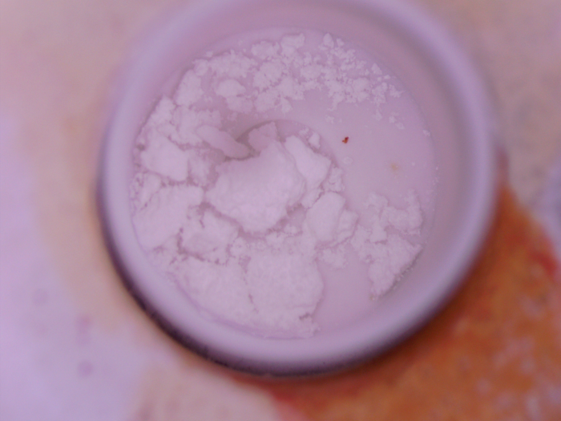
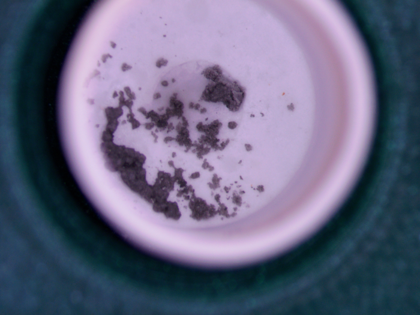
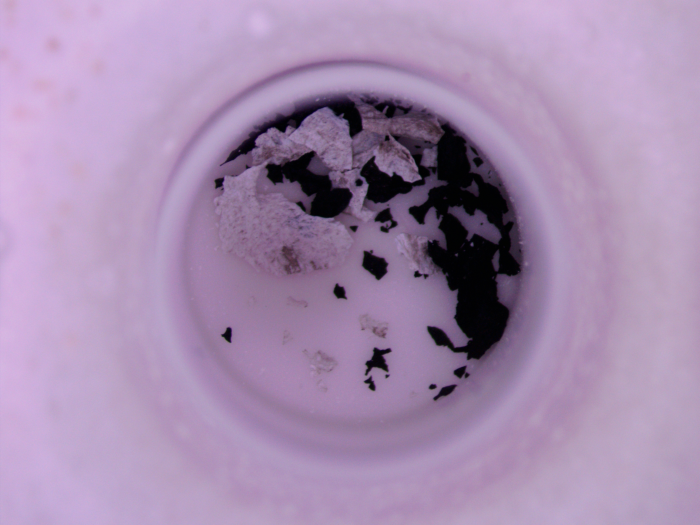
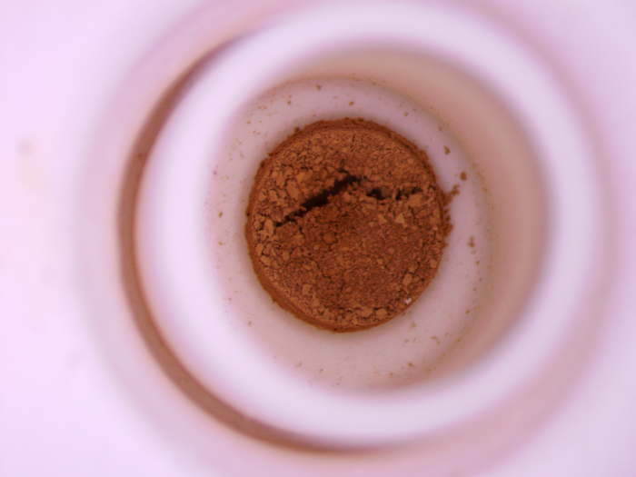
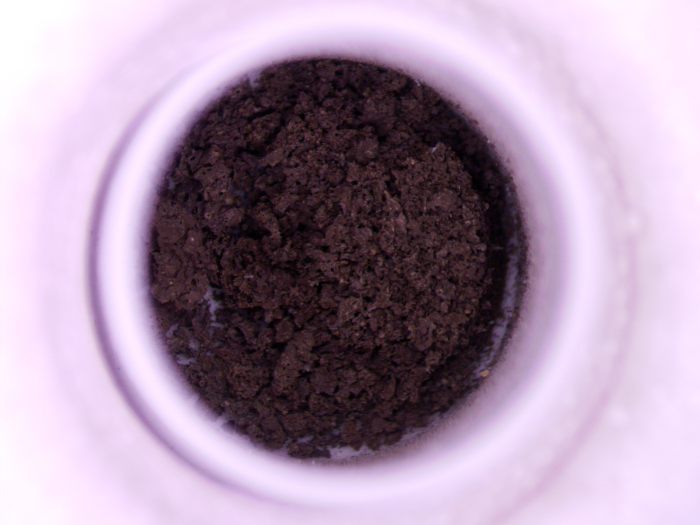
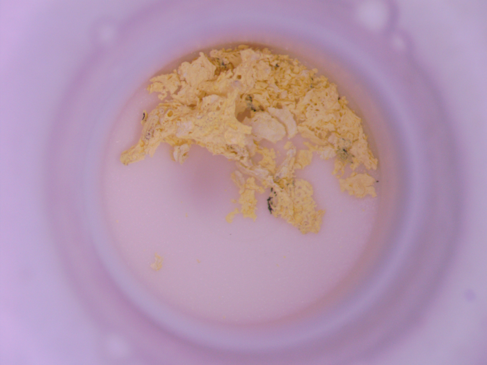
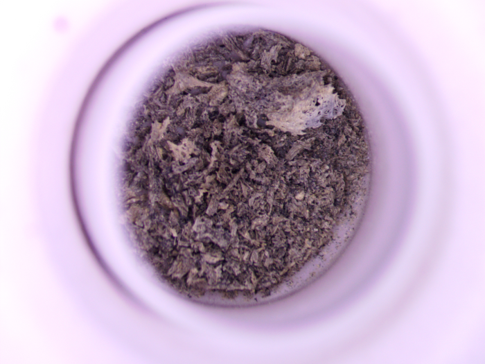
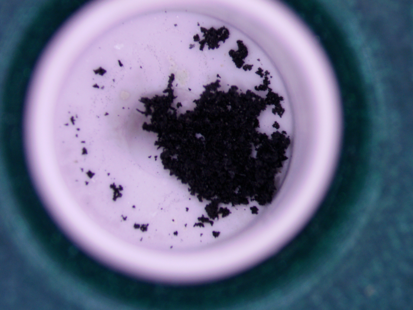
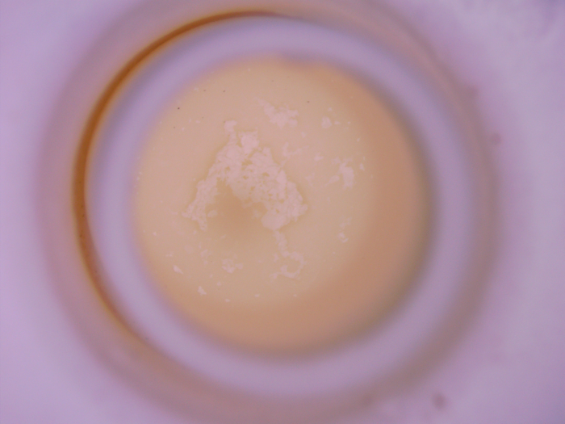

'opencv-python' package is required if trying to run the classifying.py file 

Inside the Samples folder is an executable that can be run with no dependencies or libraries.  

Here are some examples of the images you have to sort  
  

Press '0' for empty (or close to empty) crucibles  
Press '1' through '4' to judge how much sample is in each crucible.   
With '1' being the lowest amount and '4' being highest.  
Pressing 'J' will skip current photo to be judged for later at the end.      
Pressing 'K' will tell you how many images are left to be classified  
Pressing 'L' will allow you to save and quit  
