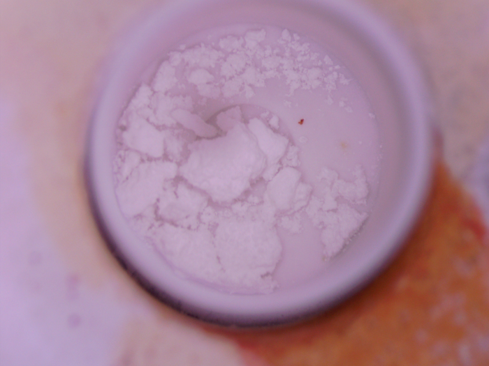
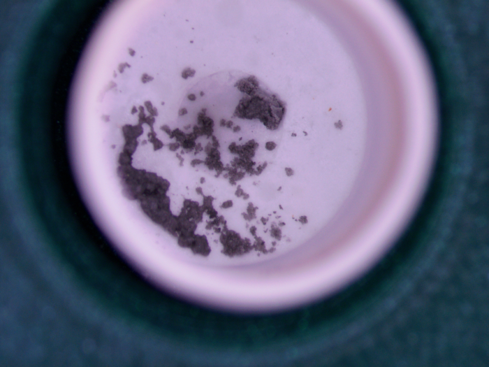
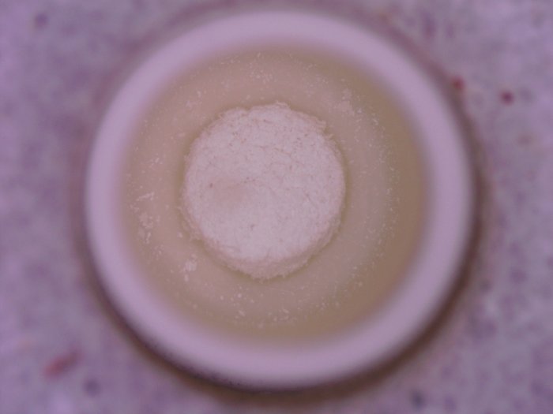
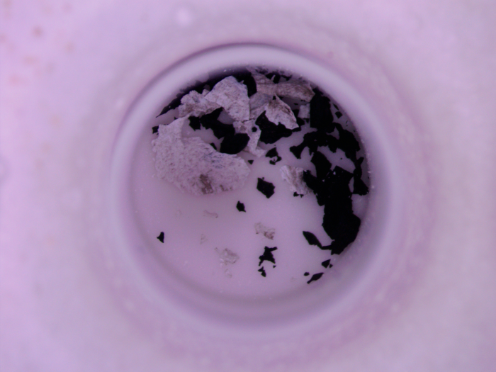
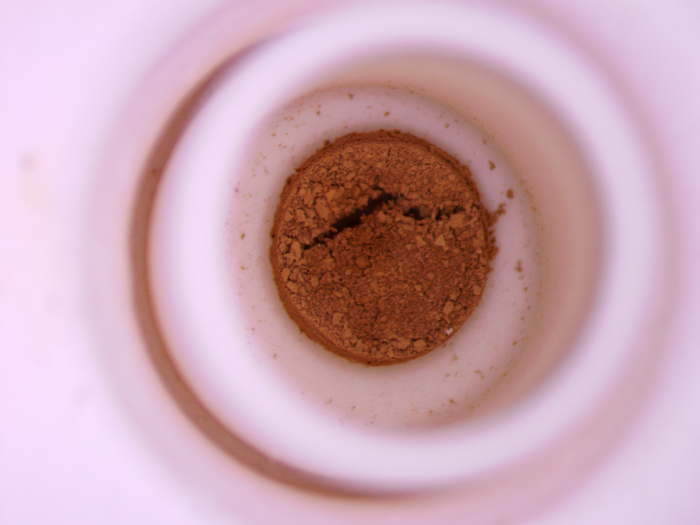
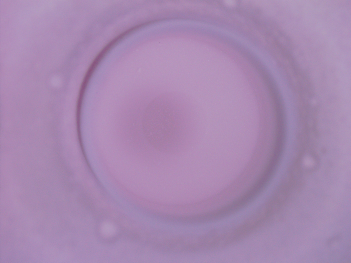
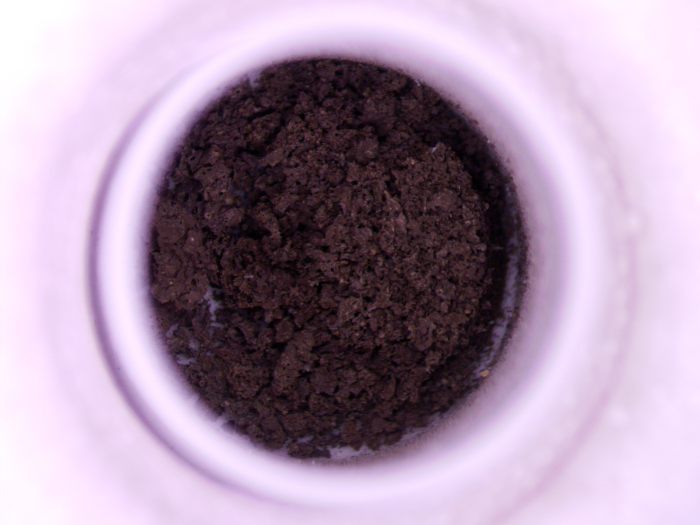
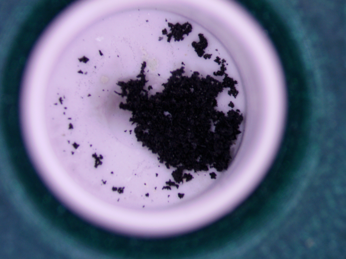

'opencv-python' package is required  

Here are some examples of the images you have to sort  
  

Press '0' for empty (or close to empty) crucibles  
Press '1' through '4' to judge how much sample is in each crucible.   
With '1' being the lowest amount and '4' being highest.  
Pressing 'L' will skip current photo to be judged for later at the end.      
Pressing 'C' will allow you to save and quit  
